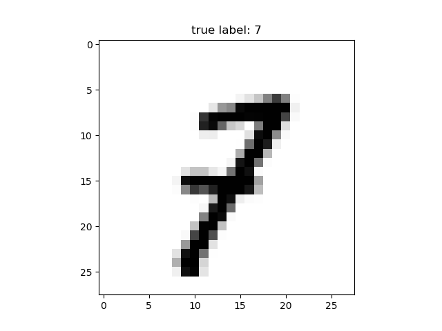
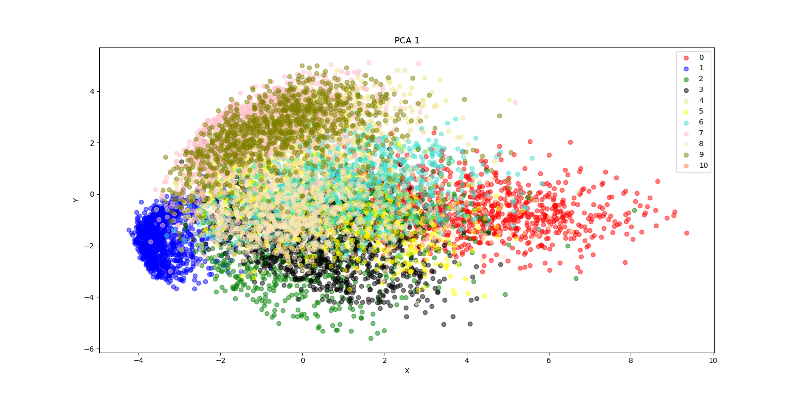
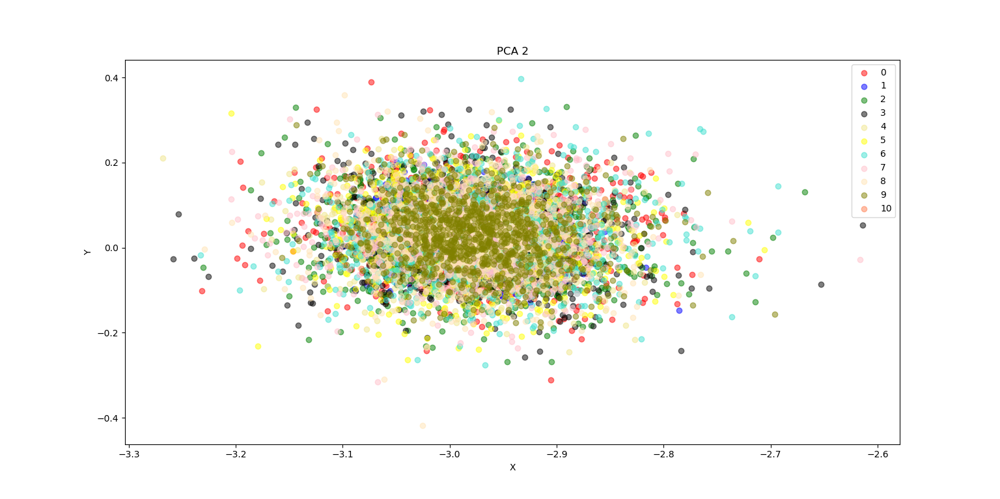

# Hello PCA & MLP

Messing around with Databases Dimensionality Reduction and classification using Multi Layers Perceptron. 

(simple academic research)

## set up and run
```

git clone https://github.com/myreli/hello-pca-mlp.git

cd hello-pca-mlp

conda create -n pcamlp

conda activate pcamlp

conda install python=3.6.5

pip install -r requirements.txt

python script.py

```

## requirements

Python > 3.6.x

Anaconda 

## about this sample

- Using `mnist` dataset tutorial from tensorflow library
> the MNIST database is a large database of handwritten digits, commonly used for ML.
- Using `matplotlib` for graphic plotation
> to graphically understand the MNIST dataset
- Using PCA from `sklearn.decomposition`
> to try it out dimensionality reduction
- Using Multi Layer Perceptron from `mlxtend.classifier` 
> to understand dimensionality reduction, each reducted db has been exposed agains 3 MLPs, A (10 hidden layers and 0.005 learning curve), B (30 hidden layers and 0.05 learning curve) and C (60 hidden layers and 0.5 learning curve).

## output 

```
reading MNIST dataset from tensorflow sample...
Extracting MNIST_data/train-images-idx3-ubyte.gz
Extracting MNIST_data/train-labels-idx1-ubyte.gz
Extracting MNIST_data/t10k-images-idx3-ubyte.gz
Extracting MNIST_data/t10k-labels-idx1-ubyte.gz

ploting random MNIST sample to prove that dataset loaded properly and understand data...

```



```
applying PCA 1 to dataset...
```

```
applying PCA 2 to dataset...
```

```
apply MLPs and display accuracy to each...

------------------------------------------------

---
[RES] Full: 

[RES] MLP 1: 93.10%
[RES] MLP 2: 87.84%
[RES] MLP 3: 10.09%

---
[RES] PCA 1: 

[RES] MLP 1: 93.25%
[RES] MLP 2: 99.68%
[RES] MLP 3: 92.83%

---
[RES] PCA 2: 

[RES] MLP 1: 93.01%
[RES] MLP 2: 19.13%
[RES] MLP 3: 9.82%

------------------------------------------------

Execution time:  81.14863263649603

```